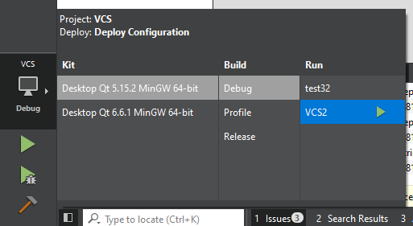

# Secure File Synchronization Tool with Version Management

## Overview

This project is a file synchronization tool with version management capabilities developed using C++ and the Qt framework. It features a user-friendly graphical user interface (GUI) and supports both local and remote file synchronization, secure authentication, version control, and multithreading for enhanced performance.

## Installation

### Prerequisites

- C++ compiler (GCC recommended)
- Qt framework (5.x or later)
- Integrated Development Environment Qt Creator

### Setup

1. Clone or download the project repository.
2. Open the project file (.pro) in Qt Creator.
3. Build and run the project.

- Make sure that the chosen configuration is the following:



## Usage

### Login/Register

1. Start the application.
2. Use the login interface to access the tool or register a new account.

### File Synchronization

1. Choose a local directory for file synchronization.
2. Perform synchronization operations such as file addition, commit changes, and pull updates.

### Version Management

- Track changes and versions of files within the selected directory.


### Logging

- Access logs for synchronization activities and error tracking.

## Features

- Login and user authentication.
- File synchronization.
- Version control for tracking file changes.
- User-friendly GUI design.

# Documentation

## MainWindow Class Documentation

### Class Overview

The `MainWindow` class manages the main window of the version control system's GUI. It handles user interactions, manages transitions between different pages (like login, registration, repository actions), and communicates with the `Controller` class to perform version control operations.

### Constructor

```cpp
MainWindow(QWidget *parent = nullptr)
```

Initializes the main window and sets up UI components and connections.

### Destructor

```cpp
~MainWindow()
```

Cleans up the resources used by the main window.

### Public Member Functions

- `showLoginPage()`: Displays the login page.
- `showRegisterPage()`: Displays the registration page.
- `showUserReposPage()`: Displays the user's repository list page.
- `showRepoActionsPage()`: Displays the page for actions on the current repository.
- `handleLogin()`: Processes user login requests.
- `handleRegister()`: Processes user registration requests.
- `handleUseRepo()`: Sets up the repository for use based on user input.
- `handleAddFiles()`: Processes adding files to the current repository.
- `handlePull()`: Executes the pull operation to synchronize the repository.
- `showLogWindow()`: Displays the log window with repository log entries.
- `handleChangeRepo()`: Allows the user to change the current repository.
- `handleLogout()`: Processes user logout and clears session data.
- `handleCommitChanges()`: Commits changes to the repository based on user input.

## Controller Class Documentation

### Class Overview

The `Controller` class is the core of the version control system, handling all backend operations such as user authentication, repository management, file tracking, and synchronization.

### Constructor

```cpp
Controller()
```

Initializes the controller with default settings.

### Public Member Functions

- `login(const QString &username, const QString &password)`: Authenticates a user.
- `registerUser(const QString &username, const QString &password)`: Registers a new user.
- `listUserRepos()`: Returns a list of repositories for the logged-in user.
- `useRepo(const QString &repoPath, bool isNewRepo, bool cloneRepo)`: Sets up a repository for usage.
- `initRepository()`: Initializes a new repository.
- `addFile(const QString &fileName)`: Adds a file to the tracking system.
- `commitChanges(const QString &message)`: Commits changes to the repository.
- `pull()`: Synchronizes the local repository with the latest version.
- `clone()`: Clones the repository from the archive.
- `getLogLines()`: Retrieves log entries from the repository.
- `emptyInfo()`: Clears current repository information.
- `logout()`: Logs out the current user and clears their session data.

### Utility Functions

Functions like `getLastRepoVersionPath()`, `repoExists()`, `copy_directory()`, etc., provide utility operations supporting the main functionalities.


